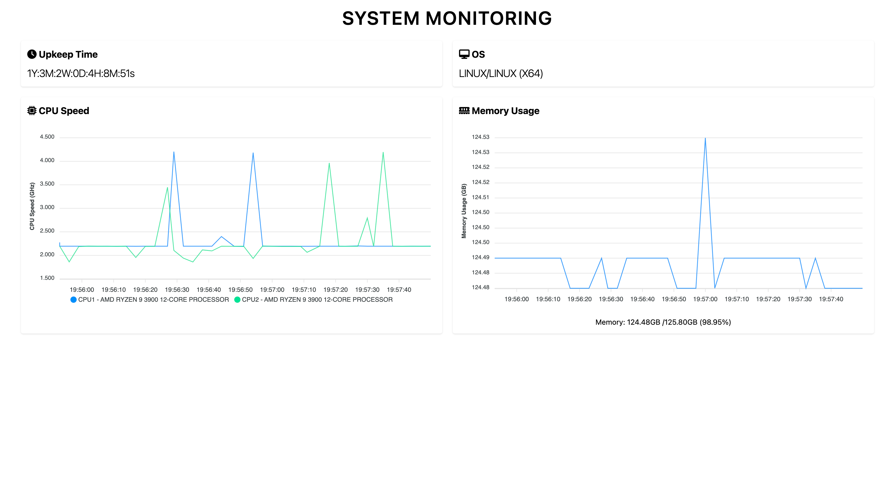

# OLLE

Bu proje, OLLE Firmasının Case'ını tamamlamak için geliştirilmiştir.

## Proje Tanımı

Bu proje, mors alfabesi kullanan API aracılığıyla sunucu hakkında bilgi veren verileri kullanarak, anlık sistem değerlerini gösteren bir sistem monitörü geliştirmeyi amaçlamaktadır. Kullanıcılar, web tarayıcılarını kullanarak bu sistem monitörü aracılığıyla sunucunun çalışma süresi, CPU bilgileri, RAM kullanımı gibi bilgilere erişebileceklerdir.

## Nasıl Kullanılır

Projenin kullanımı oldukça basittir. Aşağıdaki adımları takip ederek projeyi kullanabilirsiniz.

**Projeyi İndirme**

```
git clone https://github.com/furkanakkulak/OLLE.git
```

#### Backend

1. **Bağımlılıkları Yükleme**

   ```
   cd backend
   npm install
   ```

2. **Projeyi Başlatma**

   ```
   npm start
   ```

3. **Örnek Post İsteği**

   ```
   http://localhost:4000

   json-body:{
    command:cpu
   }
   ```

#### Frontend

1. **Bağımlılıkları Yükleme**

   ```
   cd client
   npm install
   ```

2. **Projeyi Başlatma**

   ```
   npm start
   ```

3. **Projeyi Web'de Görüntüleme**

   ```
   http://localhost:3000
   ```

## Proje Ekran Görüntüsü



Bu proje, iş başvurusunun değerlendirilmesi için hazırlanmıştır.
